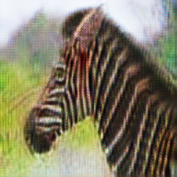
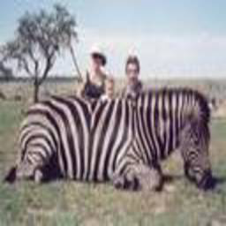
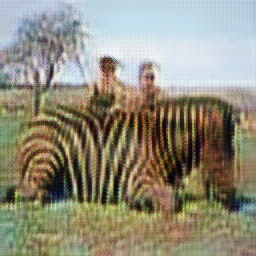
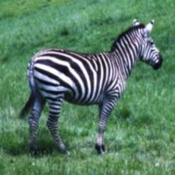

#  Unpaired Image-to-Image Translation using Cycle-Consistent Adversarial Networks(Cycle GAN)


**CycleGAN** was introduced in the now well-known 2017 paper out of Berkeley, Unpaired Image-to-Image Translation using Cycle-Consistent Adversarial Networks. It was interesting because it did not require paired training data — while an x and y set of images are still required, they do not need to directly correspond to each other. In other words, if you wanted to translate between sketches and photos, you still need to train on a bunch of sketches and a bunch of photos, but the sketches would not need to be of the exact photos in your dataset.
**CycleGAN** is a Generative Adversarial Network (GAN) that uses two generators and two discriminators.


### The Objective Function

There are two components to the CycleGAN objective function, an adversarial loss and a cycle consistency loss. Both are essential to getting good results.

# Adversarial Loss

The adversarial loss is implemented using a least-squared loss function. The discriminator and generator models for a GAN are trained under normal adversarial loss like a standard GAN model.


# Cycle Loss

Cycle Consistency Loss is a type of loss used for generative adversarial networks that performs unpaired image-to-image translation. It was introduced with the CycleGAN architecture. For two domains  and , we want to learn a mapping <math xmlns="http://www.w3.org/1998/Math/MathML">
  <mi>G</mi>
  <mo>:</mo>
  <mi>X</mi>
  <mo stretchy="false">&#x2192;</mo>
  <mi>Y</mi>
</math> and <math xmlns="http://www.w3.org/1998/Math/MathML"><mi>F</mi><mo>:</mo><mi>Y</mi><mo stretchy="false">&#x2192;</mo><mi>X</mi>
</math>. We want to enforce the intuition that these mappings should be reverses of each other and that both mappings should be bijections. Cycle Consistency Loss encourages <math xmlns="http://www.w3.org/1998/Math/MathML"><mi>F</mi><mrow data-mjx-texclass="INNER"><mo data-mjx-texclass="OPEN">(</mo><mi>G</mi><mrow data-mjx-texclass="INNER">  <mo data-mjx-texclass="OPEN">(</mo>  <mi>x</mi>  <mo data-mjx-texclass="CLOSE">)</mo></mrow><mo data-mjx-texclass="CLOSE">)</mo></mrow><mo>&#x2248;</mo> <mi>x</mi>
</math> and <math xmlns="http://www.w3.org/1998/Math/MathML"><mi>G</mi><mrow data-mjx-texclass="INNER"><mo data-mjx-texclass="OPEN">(</mo><mi>Y</mi><mrow data-mjx-texclass="INNER"><mo data-mjx-texclass="OPEN">(</mo><mi>y</mi><mo data-mjx-texclass="CLOSE">)</mo></mrow><mo data-mjx-texclass="CLOSE">)</mo></mrow><mo>&#x2248;</mo><mi>y</mi>
</math> . It reduces the space of possible mapping functions by enforcing forward and backwards consistency:


Therefore Total Loss will be


# Generator Architecture

Each CycleGAN generator has three sections: an encoder, a transformer, and a decoder. The input image is fed directly into the encoder, which shrinks the representation size while increasing the number of channels. The encoder is composed of three convolution layers. The resulting activation is then passed to the transformer, a series of six residual blocks. It is then expanded again by the decoder, which uses two transpose convolutions to enlarge the representation size, and one output layer to produce the final image in RGB.


# Discriminator Architecture

The discriminators are PatchGANs, fully convolutional neural networks that look at a “patch” of the input image, and output the probability of the patch being “real”. This is both more computationally efficient than trying to look at the entire input image, and is also more effective — it allows the discriminator to focus on more surface-level features, like texture, which is often the sort of thing being changed in an image translation task.


# Strengths and Limitations

Overall, the results produced by CycleGAN are very good — image quality approaches that of paired image-to-image translation on many tasks. This is impressive, because paired translation tasks are a form of fully supervised learning, and this is not. When the CycleGAN paper came out, it handily surpassed other unsupervised image translation techniques available at the time. In “real vs fake” experiments, humans were unable to distinguish the synthesized image from the real one about 25% of the time.

If you are planning to use CycleGAN for a practical application, it is important to be aware of its strengths and limitations. It works well on tasks that involve color or texture changes, like day-to-night photo translations, or photo-to-painting tasks like collection style transfer (see above). However, tasks that require substantial geometric changes to the image, such as cat-to-dog translations, usually fail.

# Results

**INPUT**


**Generated**


**INPUT**


**Generated**


**INPUT**


**Generated**


## Abstract
Image-to-image translation is a class of vision and graphics problems where the goal is to learn the mapping between an input image and an output image using a training set of aligned image pairs. However, for many tasks, paired training data will not be available. We present an approach for learning to translate an image from a source domain X to a target domain Y in the absence of paired examples. Our goal is to learn a mapping G:X→Y such that the distribution of images from G(X) is indistinguishable from the distribution Y using an adversarial loss. Because this mapping is highly under-constrained, we couple it with an inverse mapping F:Y→X and introduce a cycle consistency loss to push F(G(X))≈X (and vice versa). Qualitative results are presented on several tasks where paired training data does not exist, including collection style transfer, object transfiguration, season transfer, photo enhancement, etc. Quantitative comparisons against several prior methods demonstrate the superiority of our approach. 
```
@misc{zhu2020unpaired,
      title={Unpaired Image-to-Image Translation using Cycle-Consistent Adversarial Networks}, 
      author={Jun-Yan Zhu and Taesung Park and Phillip Isola and Alexei A. Efros},
      year={2020},
      eprint={1703.10593},
      archivePrefix={arXiv},
      primaryClass={cs.CV}
}
```
